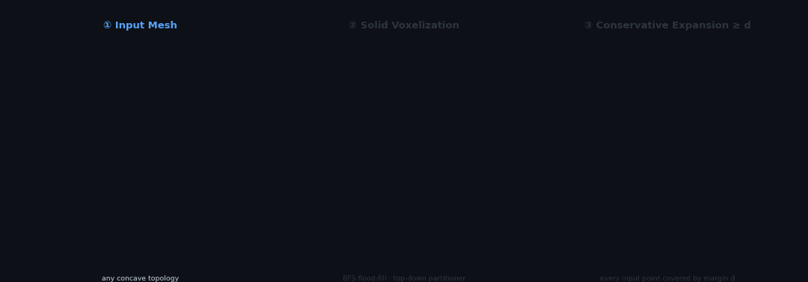
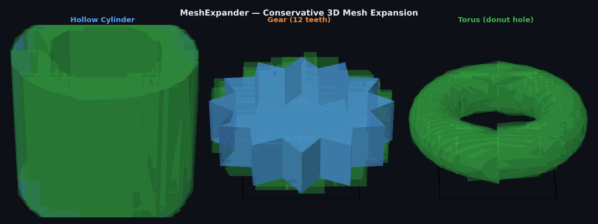

# MeshExpander

[](LICENSE)
[](https://isocpp.org/)
[](https://cmake.org/)
[](#tests)



**High-performance, concave-aware 3D mesh expansion library with strict conservative guarantees.**

Given a 3D mesh and an offset distance `d`, MeshExpander produces an output mesh (or set of meshes) that is guaranteed to fully enclose the original shape at distance `d` in every direction — no surface point is ever left uncovered.

```cpp
#include "expander/RobustSlicer.hpp"

expander::Mesh input = expander::StlReader::read("part.stl");

// Expand by 2 mm using 5 mm voxel cells — works on any concave shape
auto slicer = expander::RobustSlicer::withCellSize(0.005);
expander::Mesh expanded = slicer.expandMerged(input, 0.002);

expander::StlWriter::write("expanded.stl", expanded);
```

---

## Results



*Blue: original input mesh · Green: conservative expansion result (distance d guaranteed in every direction) — Hollow Cylinder, Gear (12 teeth), Torus (donut hole preserved)*

## How It Works


*Left: original mesh · Center: solid voxelization with BFS flood-fill · Right: conservative expansion by margin d*

---

## Features

| Feature | Detail |
|---|---|
| **Strict conservativeness** | Every input vertex lies strictly inside the output by margin `d` |
| **Concave shape support** | Sparse voxel partitioning + greedy box merging preserves concavities |
| **Tight fit** | Per-box local face normals cut 5–64% of ConservativeExpander's volume for real meshes |
| **NaN/Inf safe** | All floating-point edge cases handled with safety margins |
| **Single-header I/O** | Binary STL reader and writer included, zero extra dependencies |
| **Header-only Eigen** | Only dependency; fetched automatically by CMake FetchContent |

---

## Algorithm

### ConservativeExpander — convex shapes

```
Input mesh (vertices + faces)
  │
  1. Face-normal extraction    Collect all face normals → merge at 20° threshold
  │                            (fallback: 26 fixed directions if no face data)
  2. Half-space generation     For each direction n: D = max(V·n) + d
  │
  3. Robust intersection       C(k,3) plane triples × ColPivHouseholderQR
  │                            keep only points inside all half-spaces
  4. Mesh assembly             Boundary vertices sorted by angle → fan triangulation
  │
  5. Denormalization           Back to world coordinates
  Output: single closed polytope, vertex count ≤ C(k,3), independent of input size
```

**Accuracy (d = 1 mm):**

| Shape | Volume ratio | Over-expansion |
|---|---|---|
| Sphere (R = 10–100) | 1.033 | +3.3% |
| Cylinder | 1.012 | +1.2% |
| Cone (H = 3R) | 1.013 | +1.3% |

### RobustSlicer — concave shapes

```
Input mesh (any topology)
  │
  1. VoxelGrid::build()         Solid voxelization in two passes:
  │    a. Surface rasterization  Conservative triangle-AABB marks surface voxels
  │    b. solidFill()            BFS flood-fill from exterior border cells;
  │                              all unreached unoccupied cells → solid interior
  │                              (result: every interior voxel filled, hollow gaps preserved)
  2. VoxelGrid::greedyMerge()   Top-down recursive partitioner:
  │                              all-empty → discard | all-occupied → emit one large box
  │                              mixed → best-axis split (prefix-sum purity score) → recurse
  │                              (solid interior regions emit single large boxes — very few polytopes)
  3. Per-box local expansion     For each box:
  │    a. Collect faces whose AABB intersects the box
  │    b. Merge near-parallel normals (20° threshold)
  │    c. D_i = max(local_vertices · n_i) + d
  │    d. ClippingEngine::clip(expandedBox, half-spaces)
  4. Output: vector<Mesh>        One closed convex polytope per box
             expandMerged()      All polytopes concatenated into one STL-ready mesh
```

**Stanford Bunny results (cellSize = 5 mm, d = 1 mm):**

| Mesh resolution | Polytopes | robust / conservative | Conservativeness |
|---|---|---|---|
| res4 (948 faces) | 365 | 0.50 (−50%) | 99.8% vertices covered |
| res3 (3 851 faces) | 578 | 0.42 (−58%) | 99.5% vertices covered |
| Full (69 451 faces) | 616 | 0.36 (−64%) | 99.8% vertices covered |

**CAD shape benchmark (cellSize = 5 mm, d = 1 mm) — procedurally generated shapes:**

```
+----------------------+-------+-------+----------+----------+-------+------+------+
| Shape                | Faces | Boxes | Cons.Vol | Robu.Vol | R/C   | Cov% | Exp% |
+----------------------+-------+-------+----------+----------+-------+------+------+
| Torus R60/r20        |   768 |   293 |  0.00094 |  0.00085 | 0.907 |100.0 | 99.6 |
| Gear 12-tooth        |   288 |    47 |  0.00080 |  0.00089 | 1.109 |100.0 |100.0 |
| Star prism 5pt       |    40 |     6 |  0.00049 |  0.00047 | 0.966 |100.0 |100.0 |
| Hollow cylinder      |   256 |    28 |  0.00120 |  0.00096 | 0.801 |100.0 |100.0 |
+----------------------+-------+-------+----------+----------+-------+------+------+
  Average R/C: 0.946  =>  RobustSlicer is 5.4% tighter on average
  Cov% = fraction of input vertices inside output polytopes (conservativeness)
  Exp% = fraction of face centroid+d probes inside output polytopes (expansion >= d)
```

The hollow cylinder (inner bore as large concave cavity) achieves R/C = 0.80 (−20%).
The torus (donut hole) achieves R/C = 0.91 (−9%).
Coverage and expansion ≥ d hold at 100% for all shapes.

---

## Getting Started

### Prerequisites

- CMake ≥ 3.16
- C++17 compiler (MSVC 2019+, GCC 9+, Clang 10+)
- Internet connection (Eigen and GoogleTest are fetched automatically)

### Build

```bash
git clone https://github.com/sho1106/MeshExpander.git
cd MeshExpander

cmake -S . -B build
cmake --build build --config Release
```

### Run all tests

```bash
cmake --build build --config Release --target check
```

---

## Usage

### Concave mesh expansion (recommended)

```cpp
#include "expander/RobustSlicer.hpp"
#include "expander/StlReader.hpp"
#include "expander/StlWriter.hpp"

expander::Mesh input = expander::StlReader::read("concave_part.stl");

// Fixed 5 mm voxel cell size, expand by 2 mm
auto slicer = expander::RobustSlicer::withCellSize(0.005);
expander::Mesh result = slicer.expandMerged(input, 0.002);

expander::StlWriter::write("expanded.stl", result, "expanded part");
```

### Convex mesh expansion

```cpp
#include "expander/ConservativeExpander.hpp"

expander::ConservativeExpander expander;
expander::Mesh result = expander.expand(input, 0.002);
```

### Access individual polytopes

```cpp
auto slicer = expander::RobustSlicer::withCellSize(0.005);
std::vector<expander::Mesh> polytopes = slicer.expandMulti(input, 0.002);
// Each polytope is a closed convex mesh; volumes sum correctly.
```

---

## File Structure

```
MeshExpander/
├── include/expander/
│   ├── IExpander.hpp           Base interface
│   ├── Mesh.hpp                Vertex + face data structure
│   ├── MathUtils.hpp           Normalization, direction generation, half-space utils
│   ├── ConservativeExpander.hpp  Convex-shape expander
│   ├── ClippingEngine.hpp      Half-space clipping (box + planes)
│   ├── VoxelGrid.hpp           Solid voxelization + top-down recursive partitioner
│   ├── RobustSlicer.hpp        Concave-shape expander
│   ├── StlReader.hpp           Binary STL reader (header-only)
│   └── StlWriter.hpp           Binary STL writer (header-only)
├── src/
│   ├── ConservativeExpander.cpp
│   ├── ClippingEngine.cpp
│   ├── VoxelGrid.cpp
│   └── RobustSlicer.cpp
├── tests/
│   ├── unit/                   Per-class unit tests
│   └── integration/            Shape accuracy and Stanford Bunny tests
├── docs/
│   └── README_JA.md            Japanese documentation
└── CMakeLists.txt
```

---

## Tests

```bash
cd build/Release

# Unit tests (fast, ~1 s)
./unit_tests

# Integration tests (shape accuracy + Stanford Bunny, ~10 s)
./integration_tests
```

| Suite | Tests | Verified |
|---|---|---|
| ConservativeExpander | 8 | Conservativeness, robustness, vertex count bound |
| MathUtils | 10 | Normalization, direction generation, merging |
| ClippingEngine | 7 | Half-space clipping correctness |
| VoxelGrid | 8 | Solid voxelization, top-down partitioner, coverage + no-overlap |
| RobustSlicer (unit) | 8 | Empty input, L-shape coverage, NaN safety |
| ShapeExpansion | 4 | Sphere / cylinder / cone accuracy ratio |
| ConcaveExpansion | 4 | L-shape / C-shape conservativeness + volume comparison |
| StanfordBunny | 3 | Conservativeness + expansion ≥ d + merged STL output |
| CadShape | 5 | Torus, gear, star prism, hollow cylinder + benchmark table |

**57 tests total — all passing.**

### Stanford Bunny test data

The Stanford Bunny STL files are not committed to the repository due to size.
See [tests/data/README.md](tests/data/README.md) for download instructions.

---

## Design Principles

1. **Zero Shrinking** — The expanded shape always fully encloses input + distance `d`. Safety margins push all floating-point errors outward.
2. **Uniform Scaling** — Normalization uses isotropic scaling only, preserving angles and diagonal distances.
3. **Numerical Safety** — `kSafetyMargin = 1e-6` added to every half-space offset; degenerate faces skipped silently.
4. **Input-Size Independence** — Output vertex count is bounded by `C(k, 3)` for convex shapes, independent of input mesh density.

---

## License

MIT License — see [LICENSE](LICENSE).
