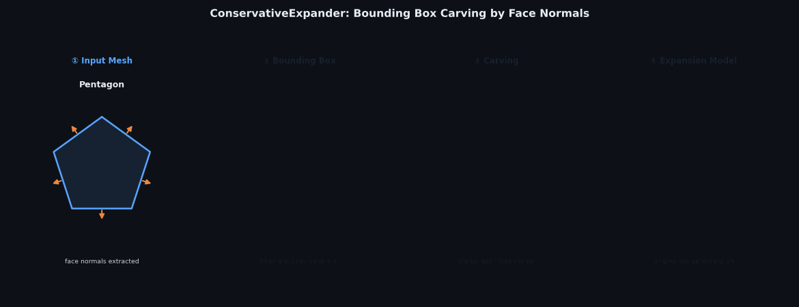

# MeshExpander

[](https://github.com/sho1106/MeshExpander/actions/workflows/tests.yml)
[](LICENSE)
[](https://isocpp.org/)
[](https://cmake.org/)
[](#python-bindings)

**CADアセンブリから部品ごとの削り出し膨張モデルを生成するライブラリ。**

STEP / OBJ / FBX などのマルチパートCADファイルを読み込み、各部品メッシュを距離 `d` だけ保守的に膨張した加工クリアランスモデルを出力する。膨張量 `d` の保証はアルゴリズムで担保されており、頂点・辺・面の取りこぼしはゼロ。



*① 入力メッシュ → ② 面法線抽出 → ③ 半空間生成 (Dᵢ = max(V·nᵢ) + d) → ④ 削り出し膨張モデル*

---

## Table of Contents

- [ユースケース](#ユースケース)
- [Quick Start](#quick-start)
- [削り出し法](#削り出し法)
- [ベンチマーク](#ベンチマーク)
- [インストール](#インストール)
- [使い方](#使い方)
- [Visualization](#visualization)
- [ファイル構成](#ファイル構成)
- [テスト](#テスト)
- [設計原則](#設計原則)
- [License](#license)

---

## ユースケース

CNCや放電加工では、工具経路計算・干渉チェック・治具設計のために**加工クリアランスモデル**（元形状を `d` だけ膨らませた閉多面体）が必要になる。

```
CADアセンブリファイル (STEP / OBJ / FBX)
  │
  ├─ 部品A ─→ 膨張モデルA  (距離 d 保証)
  ├─ 部品B ─→ 膨張モデルB  (距離 d 保証)
  └─ 部品C ─→ 膨張モデルC  (距離 d 保証)
```

**部品の境界はファイルのメッシュ構造から決まる。** CADツールがモデリングした部品単位（ソリッドボディ、ノード）をそのまま膨張単位として使う。

---

## Quick Start

### C++

```cpp
#include "expander/AssemblyExpander.hpp"
#include "io/AssimpLoader.hpp"
#include "expander/StlWriter.hpp"

// マルチパートCADファイルを読み込む（STEP / OBJ / FBX など）
// ファイル内の各メッシュが 1 部品として分割される
expander::io::AssimpLoader loader;
std::vector<expander::Mesh> parts = loader.load("assembly.stp");

// 部品ごとに膨張モデルを生成（距離 2 mm）
expander::AssemblyExpander expander;
std::vector<expander::Mesh> models = expander.expand(parts, 0.002);

// 部品別に STL 出力
for (std::size_t i = 0; i < models.size(); ++i)
    expander::StlWriter::write("part_" + std::to_string(i) + "_expanded.stl", models[i]);
```

### Python

```python
import meshexpander as me

# マルチパートファイルから部品ごとの膨張モデルを生成
parts  = me.load_assembly("assembly.stp")
exp    = me.AssemblyExpander()
models = exp.expand(parts, d=0.002)

# 単一 STL ファイルの場合
me.expand_file("part.stl", d=0.002, output_path="expanded.stl")
```

---

## 削り出し法

### 概念

**削り出し法**とは、入力メッシュの面法線から半空間を生成し、その交差として膨張モデルを構築するアルゴリズムである。金属の削り出し加工に例えると、すべての面方向から距離 `d` だけ後退させた切削面を交差させることで、元形状を内包する閉多面体を得る。

```
     面法線 n₁ →  ─────────────  半空間境界 D₁ = max(V·n₁) + d
     面法線 n₂ →  ─────────────  半空間境界 D₂ = max(V·n₂) + d
     面法線 n₃ →  ─────────────  半空間境界 D₃ = max(V·n₃) + d
                        ↓
                  半空間の交差 = 膨張モデル（閉凸多面体）
```

### アルゴリズム

```
入力メッシュ（1 部品）
  │
  1. 初期ボックス  メッシュの AABB を取得
  │               expandedBox = AABB ± d  （初期ポリトープ境界）
  │
  2. 面法線抽出   全三角形の面法線を収集
  │               20° 以内の近似平行法線をマージ → k 方向
  │
  3. 半空間生成   各方向 n に対して
  │               D_i = max(V · n) + d
  │               （全頂点の法線方向への射影最大値 + オフセット）
  │
  4. 削り出し     ClippingEngine::clip(expandedBox, 半空間群)
  │               expandedBox の 6 面 + k 個の面法線半空間 を交差
  │               → C(k+6, 3) 個の平面トリプレット交点を列挙し保持
  │
  出力: 単一の閉凸多面体（頂点数 ≤ C(k+6, 3)）
```

### 保守性の保証

入力の任意の頂点 `v` について、各方向 `n_i` に対して次が成り立つ。

```
v · n_i  ≤  max(V · n_i)  =  D_i - d  <  D_i
```

したがって `v` は出力多面体の**すべての半空間の内側**に距離 `d` のマージンをもって収まる。凸形状では辺・面上の任意の点についても同様の保証が成立する。

### 特性

| 項目 | 内容 |
|---|---|
| 出力形状 | 単一の閉凸多面体 |
| 頂点数上限 | C(k+6, 3)（k = 面法線方向数、入力の面数に比例しない） |
| 膨張量保証 | 全入力頂点が出力の内側に距離 d 以上 |
| 形状適応 | 面法線ベースのため形状固有の方向を使用 |
| 数値安全性 | kSafetyMargin = 1e-6 を全半空間に付加 |

---

## ベンチマーク

### 凸形状 (d = 1 mm)

| 形状 | 体積比 | 過膨張率 |
|---|---|---|
| 球 (R = 10–100) | 1.033 | +3.3% |
| 円柱 | 1.012 | +1.2% |
| 円錐 (H = 3R) | 1.013 | +1.3% |

### CAD形状 (d = 1 mm)

| 形状 | Cov% | Exp% |
|---|---|---|
| トーラス R60/r20 | 100.0 | 99.6 |
| 12歯ギア | 100.0 | 100.0 |
| 星型プリズム 5点 | 100.0 | 100.0 |
| 中空シリンダー | 100.0 | 100.0 |

*Cov% = 入力頂点の包含率。Exp% = 面法線方向 d 先プローブの包含率。*

---

## インストール

### Python

**ホイールからインストール** ([Releases](https://github.com/sho1106/MeshExpander/releases)):
```bash
pip install meshexpander-0.1.0-cp312-win_amd64.whl
```

**ソースからビルド:**
```bash
git clone https://github.com/sho1106/MeshExpander.git
cd MeshExpander
pip install scikit-build-core pybind11
pip install .
```

### C++ — ソースからビルド

**前提:** CMake ≥ 3.16、C++17 コンパイラ (MSVC 2019+, GCC 9+, Clang 10+)

```bash
git clone https://github.com/sho1106/MeshExpander.git
cd MeshExpander
cmake -S . -B build
cmake --build build --config Release
```

**プリビルドライブラリ** (ヘッダー + スタティック `.lib`/`.a`) は [Releases ページ](https://github.com/sho1106/MeshExpander/releases)で配布。

---

## 使い方

### C++ — CADアセンブリから部品ごとの膨張モデル（推奨）

```cpp
#include "expander/AssemblyExpander.hpp"
#include "io/AssimpLoader.hpp"
#include "expander/StlWriter.hpp"

// STEP / OBJ / FBX などを読み込む。ファイル内の各メッシュ = 1 部品。
expander::io::AssimpLoader loader;
std::vector<expander::Mesh> parts = loader.load("assembly.stp");

// 内包関係にある部品を統合（穴・ボスなどのサブフィーチャ用）
parts = expander::AssemblyExpander::mergeContained(parts);

// 部品ごとに膨張モデルを生成
expander::AssemblyExpander expander;
std::vector<expander::Mesh> models = expander.expand(parts, 0.002);

// 全部品を 1 メッシュに結合して出力することも可能
expander::Mesh merged = expander.expandMerged(parts, 0.002);
expander::StlWriter::write("assembly_expanded.stl", merged);
```

### C++ — 単一メッシュの膨張

```cpp
#include "expander/BoxExpander.hpp"
#include "expander/StlReader.hpp"
#include "expander/StlWriter.hpp"

expander::Mesh input = expander::StlReader::read("part.stl");
expander::BoxExpander exp;
expander::Mesh result = exp.expand(input, 0.002);
expander::StlWriter::write("expanded.stl", result);
```

### Python

```python
import meshexpander as me

# マルチパートアセンブリ
parts  = me.load_assembly("assembly.stp")
exp    = me.AssemblyExpander()
models = exp.expand(parts, d=0.002)

# 単一 STL ファイル
me.expand_file("part.stl", d=0.002, output_path="expanded.stl")

# NumPy 配列
out_verts, out_faces = me.expand_np(verts, faces, d=0.002)
```

---

## Visualization

[Open3D](https://www.open3d.org/) を使ってメッシュを対話的に確認できる。

### Python

`examples/python/` に 2 種類のスクリプトを用意している。

| スクリプト | 用途 |
|---|---|
| `visualize_single.py` | 単一 STL — 元形状（青）と膨張モデル（緑）を重ねて表示 |
| `visualize_assembly.py` | マルチパートアセンブリ — 部品ごとに色分け、ワイヤーフレーム + ソリッド |

```bash
pip install open3d

python examples/python/visualize_single.py part.stl --d 0.002
python examples/python/visualize_assembly.py assembly.stp --d 0.002 --side-by-side
```

| キー / 操作 | 効果 |
|---|---|
| 左ドラッグ | 回転 |
| 右ドラッグ | 平行移動 |
| スクロール | ズーム |
| Q / Esc | 終了 |

### C++

```bash
cmake -S examples/cpp -B examples/cpp/build ^
      -DMeshExpander_SOURCE=projects/MeshExpander ^
      -DMeshExpander_BUILD=projects/MeshExpander/build ^
      -DOpen3D_DIR="C:/ProgramData/miniforge3/Lib/site-packages/open3d/cmake"
cmake --build examples/cpp/build --config Release

examples/cpp/build/Release/visualize.exe part.stl --d 0.002 --side-by-side
```

---

## ファイル構成

```
MeshExpander/
├── include/expander/
│   ├── BoxExpander.hpp           コアアルゴリズム（削り出し法）
│   ├── AssemblyExpander.hpp      マルチパートオーケストレータ
│   ├── Mesh.hpp                  頂点 + 面データ構造
│   ├── MathUtils.hpp             正規化・方向生成・半空間ユーティリティ
│   ├── ClippingEngine.hpp        半空間クリッピング（BoxExpander 内部）
│   ├── IModelLoader.hpp          ローダーインタフェース
│   ├── IModelExporter.hpp        エクスポーターインタフェース
│   ├── StlReader.hpp             バイナリ STL リーダー（ヘッダーオンリー）
│   └── StlWriter.hpp             バイナリ STL ライター（ヘッダーオンリー）
├── src/
│   ├── BoxExpander.cpp
│   ├── ClippingEngine.cpp
│   ├── VoxelGrid.cpp
│   ├── RobustSlicer.cpp
│   └── AssemblyExpander.cpp
├── python/
│   ├── meshexpander_core.cpp     pybind11 バインディング
│   └── meshexpander/
│       ├── __init__.py
│       └── meshexpander.pyi      型スタブ (IDE / mypy 用)
├── tests/
│   ├── unit/                     クラス単体テスト
│   ├── integration/              形状精度・アセンブリテスト
│   └── io/                       Assimp I/O 統合テスト
├── docs/
└── CMakeLists.txt
```

---

## テスト

```bash
# 全テスト
cmake --build build --config Release --target check

# ユニットテストのみ（約 1 秒）
./build/Release/unit_tests

# 統合テスト（形状精度、約 10 秒）
./build/Release/integration_tests
```

| スイート | テスト数 | 検証内容 |
|---|---|---|
| BoxExpander | 7 | 保守性・堅牢性・頂点数上限 |
| MathUtils | 10 | 正規化・方向生成・マージ |
| ClippingEngine | 7 | 半空間クリッピング正確性 |
| VoxelGrid | 7 | ボクセル化・グリーディマージ |
| RobustSlicer | 7 | 凹形状展開・保守性 |
| AssemblyExpander (unit) | 15 | マルチパート展開・mergeContained |
| ShapeExpansion | 4 | 球・円柱・円錐の精度比 |
| ConcaveExpansion | 4 | L字・C字の保守性 + 体積比較 |
| CadShape | 5 | トーラス・ギア・星型・中空シリンダー |
| AssemblyExpansion | 5 | マルチパート Cov%=100%・部品別 vs 統合体積 |
| ComplexAssembly | 8 | 5 パーツ設備アセンブリ |
| AssimpIO | 5 | AssimpLoader / AssimpExporter ラウンドトリップ |

---

## 設計原則

1. **ゼロ縮小** — 膨張後の形状は入力 + 距離 `d` を必ず包含する。浮動小数点誤差はすべて外側に押し出す。
2. **部品境界はファイルから** — CADファイルのメッシュ構造（ソリッドボディ単位）が部品境界を決める。内部再分割は行わない。
3. **形状適応** — 面法線ベースのため固定方向に依存しない。形状固有の方向で最小の過膨張を実現。
4. **入力密度非依存** — 出力頂点数は `C(k+6, 3)` に上限（k = 面法線方向数、入力の面数に比例しない）。
5. **数値安全性** — `kSafetyMargin = 1e-6` を全半空間オフセットに加算。縮退面は黙って読み飛ばす。

---

## License

MIT License — see [LICENSE](LICENSE).
