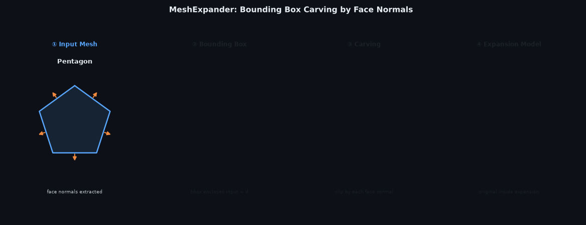

# MeshExpander

[](https://github.com/sho1106/MeshExpander/actions/workflows/tests.yml)
[](LICENSE)
[](https://isocpp.org/)
[](https://cmake.org/)
[](#installation)

**English** | [日本語](docs/README_JA.md)

**A C++17 library that generates per-part machining-clearance models from CAD assemblies.**

It reads a multi-part CAD file (STEP / OBJ / FBX), and for each part mesh produces a conservatively *expanded* polytope grown outward by a distance `d` — a clearance model for CNC / EDM toolpaths, interference checking, and fixture design. The expansion distance `d` is **algorithmically guaranteed**: no vertex, edge, or face of the input is ever left uncovered.

> **For:** CNC / EDM toolpath & fixture engineers who need a *provably conservative* clearance shell — and developers who want a lightweight, embeddable mesh-expansion primitive.



*① input mesh → ② face-normal extraction → ③ half-space generation (Dᵢ = max(V·nᵢ) + d) → ④ carved expanded model*

---

## Table of Contents

- [Use case](#use-case)
- [When to use / when NOT to use](#when-to-use--when-not-to-use)
- [Quick Start](#quick-start)
- [The carving method](#the-carving-method)
- [Benchmarks](#benchmarks)
- [Installation](#installation)
- [Usage](#usage)
- [Visualization](#visualization)
- [Project layout](#project-layout)
- [Tests](#tests)
- [Design principles](#design-principles)
- [Contributing](#contributing)
- [License](#license)

---

## Use case

CNC and EDM machining need a **clearance model** — the original shape inflated by `d` into a closed polytope — for toolpath computation, interference checking, and fixture design.

```
CAD assembly file (STEP / OBJ / FBX)
  │
  ├─ Part A ─→ expanded model A  (distance d guaranteed)
  ├─ Part B ─→ expanded model B  (distance d guaranteed)
  └─ Part C ─→ expanded model C  (distance d guaranteed)
```

**Part boundaries come from the file's mesh structure.** The part units modeled by the CAD tool (solid bodies, scene nodes) are used directly as expansion units.

> **Units.** MeshExpander is unit-agnostic — coordinates and `d` are in your model's own units. Each part is normalized internally before clipping, so results are robust across scales (verified from micrometers to kilometers); just keep `d` in the same units as the geometry.

---

## When to use / when NOT to use

MeshExpander produces a **conservative outer shell** that contains the original shape. It is **not** a true minimal (Minkowski) offset.

| ✅ Good fit | ❌ Poor fit |
|---|---|
| Interference checks, fixture/clamp envelopes | Accurate clearance *inside* pockets, holes, slots (concave features get filled) |
| Guaranteed stock-block (billet) sizing | Faithful offset of organic / freeform surfaces |
| Anything needing a "never smaller than the part" guarantee | Through-slots / keyways where convex hull = AABB (decomposition barely helps) |
| A lightweight, low-poly closed polytope from a dense mesh | Shrinking / negative offset |

### Why not OpenVDB / CGAL?

| Tool | Strength | Weakness for this job |
|---|---|---|
| **MeshExpander** | Analytic containment guarantee (zero shrink), low-poly (input-density-independent), Eigen-only, MIT, pip-installable | Over-expands / convex-ish; weak on grooves & channels |
| **OpenVDB** | True offset of arbitrary concave topology; robust | Resolution-dependent, *no* analytic guarantee; high-poly output; heavy deps (TBB, etc.) |
| **CGAL** (Minkowski) | Exact offset | O(n³m³) — slow on large CAD; GPL/GMP build & license burden |
| **trimesh / Open3D** | I/O, SDF queries | No built-in mesh-offset operation |

In short, MeshExpander's wedge is **"a guaranteed, low-poly, lightweight clearance shell for machining."** If you need a true offset or faithful concave following, use OpenVDB.

---

## Quick Start

The shortest path that works straight after `pip install` — no extra deps, no build. Try it with the bundled binary-STL sample.
(The relative path `examples/data/cube.stl` below assumes you run from the **root of the cloned repo**; use an absolute path otherwise.)

### Python — single STL (start here)

```python
import meshexpander as me

# Expand the bundled sample (examples/data/cube.stl, binary STL) by 1mm
result = me.expand_file("examples/data/cube.stl", d=1.0, output_path="expanded.stl")
print(result.vertices.shape, result.faces.shape)

# NumPy arrays in / out
out_verts, out_faces = me.expand_np(verts, faces, d=1.0)
```

> **Binary STL only.** ASCII STL is not accepted — `read_stl` / `expand_file` raise on it. Choose "Binary" when exporting from FreeCAD / MeshLab etc.

### C++ — single mesh

```cpp
#include "expander/BoxExpander.hpp"
#include "expander/StlReader.hpp"
#include "expander/StlWriter.hpp"

expander::Mesh input  = expander::StlReader::read("part.stl");  // binary STL
expander::BoxExpander exp;
expander::Mesh result = exp.expand(input, 1.0);                 // d = 1mm
expander::StlWriter::write("expanded.stl", result);
```

### Multi-part CAD assembly (STEP / OBJ / FBX)

> ⚠️ **Reading STEP / OBJ / FBX needs the optional Assimp IO layer**, which is *not* in the default build (or the distributed wheels).
> Build C++ with `cmake -DMESHEXPANDER_BUILD_IO=ON`; in Python, `load_assembly` exists only when `me.HAS_IO` is `True` (a wheel built from source with IO enabled).
> For STL only, the single-mesh path above needs no IO layer.

```python
import meshexpander as me
assert me.HAS_IO, "load_assembly requires a build with MESHEXPANDER_BUILD_IO=ON"

parts  = me.load_assembly("assembly.stp")   # each mesh in the file = one part
parts  = me.merge_contained(parts)          # fold nested sub-features (holes, bosses)
models = me.expand_assembly(parts, d=1.0)
```

---

## The carving method

### Concept

The **carving method** builds the expanded model by generating half-spaces from the input mesh's face normals and intersecting them. By analogy with subtractive machining: retract a cutting plane by `d` along every face direction, intersect them all, and you get a closed polytope that contains the original shape.

```
     face normal n₁ →  ─────────────  half-space bound D₁ = max(V·n₁) + d
     face normal n₂ →  ─────────────  half-space bound D₂ = max(V·n₂) + d
     face normal n₃ →  ─────────────  half-space bound D₃ = max(V·n₃) + d
                        ↓
                  intersection of half-spaces = expanded model (closed convex polytope)
```

### Algorithm

```
input mesh (one part)
  │
  1. Initial box   take the mesh AABB
  │                expandedBox = AABB ± d   (initial polytope bound)
  │
  2. Face normals  collect all triangle normals
  │                merge near-parallel normals within 20° → k directions
  │
  3. Half-spaces   for each direction n:
  │                D_i = max(V · n) + d
  │                (max projection of all vertices along n, plus the offset)
  │
  4. Carve         ClippingEngine::clip(expandedBox, half-spaces)
  │                intersect the 6 box faces + k face-normal half-spaces
  │                → enumerate & keep the C(k+6, 3) plane-triple intersections
  │
  output: a single closed convex polytope (vertex count ≤ C(k+6, 3))
```

### Conservativeness guarantee

For any input vertex `v` and every direction `n_i`:

```
v · n_i  ≤  max(V · n_i)  =  D_i - d  <  D_i
```

so `v` lies **inside every half-space** of the output with a margin of `d`. → The generated hull provably never under-covers the part, so a clearance/interference check built on it cannot return a false "safe."

### Properties

| Property | Detail |
|---|---|
| Output shape | A single closed convex polytope |
| Vertex-count bound | C(k+6, 3) (k = number of face-normal directions; independent of input face count) |
| Expansion guarantee | Every input vertex sits at least `d` inside the output |
| Shape-adaptive | Uses shape-specific directions (face normals), not a fixed direction set |
| Numerical safety | kSafetyMargin = 1e-6 added to every half-space |

---

## Conservative simplification (progressive hull)

A carved model is an intersection of half-spaces, so **removing a half-space only
*enlarges* the polytope** — the simplified result still contains the original
(its volume only grows). `BoxExpander::expandSimplified` greedily drops the
half-space that adds the least volume until a target face count or a volume
budget is reached, trading a little extra over-expansion for far fewer output
faces while staying conservative.

```cpp
#include "expander/BoxExpander.hpp"

expander::ProgressiveHull::Options opt;
opt.maxFaces        = 48;    // stop at <= 48 faces ...
opt.maxVolumeGrowth = 0.10;  // ... or before volume grows past +10%
expander::Mesh out = expander::BoxExpander().expandSimplified(mesh, 1.0, opt);
```

The greedy step re-clips per candidate (an exact, unoptimized reference
implementation), so it is an offline pass suited to the modest half-space counts
of carved models. The face-count vs over-expansion tradeoff is controlled by
`maxFaces` / `maxVolumeGrowth`. *Simplification runs in world coordinates — keep
models near millimetre scale.*

---

## Benchmarks

### Convex shapes (d = 1 mm)

| Shape | Volume ratio | Over-expansion | Fixed 26-dir |
|---|---|---|---|
| Sphere (R = 10–100) | 1.033 | +3.3% | ~1.14 |
| Cylinder | 1.012 | +1.2% | ~1.055 |
| Cone (H = 3R) | 1.013 | +1.3% | ~2.0–2.2 (apex hit) |

*The right column is the volume ratio of the fixed-26-direction method. Because the face-normal mode uses shape-specific directions, it avoids the cone-apex over-expansion (ratio > 2.0) that fixed directions suffer.*

### CAD shapes (d = 1 mm)

| Shape | Cov% | Exp% |
|---|---|---|
| Torus R60/r20 | 100.0 | 99.6 |
| 12-tooth gear | 100.0 | 100.0 |
| 5-point star prism | 100.0 | 100.0 |
| Hollow cylinder | 100.0 | 100.0 |

*Cov% = fraction of input vertices contained. Exp% = fraction of face-normal `d`-probes contained.*

### Concave shapes (approximate convex decomposition, d = 1 mm)

Setting `maxConvexPieces` / `concavityTol` splits a part by **concavity-driven spatial box partitioning**, carves each box, and unions them. Concave regions are expanded without being filled; polygon count scales roughly with the piece count.

| Shape | Pieces K | Volume ratio | Output faces |
|---|---|---|---|
| L-prism | 1 (= single convex) | 1.775 | 12 |
| L-prism | 4 | 1.591 | 48 |
| L-prism | 8 | 1.418 | 96 |

*Higher K reduces the wasted fill volume; output face count scales with K. Cov% = 100% at all K.*

> **Scope:** effective for concave corners and steps. For channels/grooves where the convex hull equals the AABB, a union of axis-aligned boxes cannot carve the concavity, so the improvement is limited (it degrades to single-convex).

---

## Installation

### Python

**From a wheel** ([Releases](https://github.com/sho1106/MeshExpander/releases)):
```bash
pip install meshexpander-0.1.0-cp312-win_amd64.whl
```

> Prebuilt wheels currently center on **Windows / CPython 3.12**. For other platforms/versions, build from source below.
> All wheels ship STL only (no IO layer → `me.HAS_IO == False`). For STEP/OBJ/FBX, build from source with IO enabled.

**From source:**
```bash
git clone https://github.com/sho1106/MeshExpander.git
cd MeshExpander
pip install scikit-build-core pybind11
pip install .
```

### C++ — build from source

**Prerequisites:** CMake ≥ 3.16, a C++17 compiler (MSVC 2019+, GCC 9+, Clang 10+).

```bash
git clone https://github.com/sho1106/MeshExpander.git
cd MeshExpander
cmake -S . -B build
cmake --build build --config Release
```

**Consuming from another CMake project** (after `cmake --install build`):
```cmake
find_package(MeshExpander REQUIRED)
target_link_libraries(your_target PRIVATE MeshExpander::mesh_expander)
```

Prebuilt libraries (headers + static `.lib`/`.a`) are also published on the [Releases page](https://github.com/sho1106/MeshExpander/releases).

---

## Usage

### C++ — per-part expansion from a CAD assembly (recommended)

```cpp
#include "expander/AssemblyExpander.hpp"
#include "io/AssimpLoader.hpp"        // build with -DMESHEXPANDER_BUILD_IO=ON
#include "expander/StlWriter.hpp"

// Load STEP / OBJ / FBX etc. Each mesh in the file = one part.
expander::io::AssimpLoader loader;
std::vector<expander::Mesh> parts = loader.load("assembly.stp");

// Fold contained parts into their parent (holes, bosses, sub-features)
parts = expander::AssemblyExpander::mergeContained(parts);

// Expand each part
expander::AssemblyExpander expander;
std::vector<expander::Mesh> models = expander.expand(parts, 1.0);

// Or concatenate all parts into one mesh for export
expander::Mesh merged = expander.expandMerged(parts, 1.0);
expander::StlWriter::write("assembly_expanded.stl", merged);
```

### C++ — concave expansion (approximate convex decomposition)

```cpp
#include "expander/AssemblyExpander.hpp"

// Default is single-convex. Enable concave handling via options.
expander::AssemblyExpander::Options opts;
opts.maxConvexPieces = 8;     // up to 8 convex pieces per part
opts.concavityTol    = 0.0;   // split until concavity ≤ this tolerance

expander::AssemblyExpander expander(opts);
std::vector<expander::Mesh> models = expander.expand(parts, 1.0);
```

### C++ — single mesh

```cpp
#include "expander/BoxExpander.hpp"
#include "expander/StlReader.hpp"
#include "expander/StlWriter.hpp"

expander::Mesh input = expander::StlReader::read("part.stl");
expander::BoxExpander exp;
expander::Mesh result = exp.expand(input, 1.0);
expander::StlWriter::write("expanded.stl", result);
```

### Python

```python
import meshexpander as me

# Multi-part assembly (needs HAS_IO)
parts  = me.load_assembly("assembly.stp")
models = me.expand_assembly(parts, d=1.0)

# Concave: per-part expansion via approximate convex decomposition
models = me.expand_assembly(parts, d=1.0, max_convex_pieces=8)

# Single STL file
me.expand_file("part.stl", d=1.0, output_path="expanded.stl")

# NumPy arrays
out_verts, out_faces = me.expand_np(verts, faces, d=1.0)

# Anisotropic (directional) clearance: per-axis d = [dx, dy, dz]
# e.g. 3mm axial pull-out (Z) but 0.5mm radial finish stock (X, Y)
out_verts, out_faces = me.expand_np(verts, faces, d=[0.5, 0.5, 3.0])
result = me.BoxExpander().expand(mesh, [0.5, 0.5, 3.0])
```

> **Anisotropic expansion.** Passing `d` as `[dx, dy, dz]` offsets each axis-aligned
> face by its own component (the offset is the ellipsoid support `‖n⊙d‖`); a uniform
> vector reduces exactly to the scalar ball expansion. Useful for directional
> machining clearance.

---

## Visualization

Inspect meshes interactively with [Open3D](https://www.open3d.org/).

### Python

Three scripts live in `examples/python/`.

| Script | Purpose |
|---|---|
| `visualize_single.py` | Single STL — overlay original (blue) and expanded (green) |
| `visualize_assembly.py` | Multi-part assembly — per-part colors, wireframe + solid (generates a demo with no args) |
| `visualize_compare.py` | Side-by-side single-convex (K=1) vs concave decomposition (K>1) |

```bash
pip install open3d

# Try with the bundled sample
python examples/python/visualize_single.py examples/data/cube.stl --d 1.0

# Auto-generate and show a demo assembly (no args)
python examples/python/visualize_assembly.py --side-by-side
```

| Key / action | Effect |
|---|---|
| Left-drag | Rotate |
| Right-drag | Pan |
| Scroll | Zoom |
| Q / Esc | Quit |

### C++

```bash
cmake -S examples/cpp -B examples/cpp/build ^
      -DMeshExpander_SOURCE=projects/MeshExpander ^
      -DMeshExpander_BUILD=projects/MeshExpander/build ^
      -DOpen3D_DIR="C:/ProgramData/miniforge3/Lib/site-packages/open3d/cmake"
cmake --build examples/cpp/build --config Release

examples/cpp/build/Release/visualize.exe part.stl --d 1.0 --side-by-side
```

---

## Project layout

```
MeshExpander/
├── include/expander/
│   ├── BoxExpander.hpp           core carving algorithm
│   ├── AssemblyExpander.hpp      multi-part orchestrator
│   ├── BoxPartitioner.hpp        concave support: concavity-driven box partitioning
│   ├── ClippingEngine.hpp        half-space clipping (internal to BoxExpander)
│   ├── Mesh.hpp                  vertex + face data structure
│   ├── MathUtils.hpp             normalization / direction / half-space utilities
│   ├── StlReader.hpp             binary STL reader (header-only)
│   └── StlWriter.hpp             binary STL writer (header-only)
├── src/                          BoxExpander / ClippingEngine / BoxPartitioner / AssemblyExpander
├── src/io/, include/io/          optional Assimp loader/exporter (STEP/OBJ/FBX)
├── src/cli/                      meshexpander_cli (requires IO layer)
├── python/                       pybind11 bindings + type stubs
├── tests/                        unit / integration / io
├── examples/                     python & cpp visualizers + sample data
├── docs/                         README_JA.md + images
└── CMakeLists.txt
```

---

## Tests

```bash
# All tests
cmake --build build --config Release --target check

# Unit tests only (~1s)
./build/Release/unit_tests

# Integration tests (shape accuracy, ~10s)
./build/Release/integration_tests
```

| Suite | Kind | What it checks |
|---|---|---|
| BoxExpander | unit | conservativeness, robustness, vertex-count bound |
| MathUtils | unit | normalization, direction generation, merging |
| ClippingEngine | unit | half-space clipping correctness |
| BoxPartitioner | unit | concavity calc, convex/concave split, empty-box exclusion |
| AssemblyExpander | unit | multi-part expansion, mergeContained |
| StlReader | unit | binary roundtrip, ASCII/corrupt rejection |
| ShapeExpansion | integration | sphere / cylinder / cone accuracy ratio |
| CadShape | integration | torus / gear / star / hollow cylinder |
| ComplexShape | integration | BumpySphere / GroovedCylinder volume ratio |
| ConcaveExpansion | integration | L/C-shape Cov%=100% + volume reduction + knob monotonicity |
| AssemblyExpansion | integration | multi-part Cov%=100%, per-part vs merged volume |
| ComplexAssembly | integration | 5-part equipment assembly |
| AssimpIO | io | AssimpLoader / AssimpExporter roundtrip (IO build only) |

---

## Design principles

1. **Zero shrinking** — the expanded shape always contains the input + distance `d`; all floating-point error is pushed outward.
2. **Part boundaries from the file** — the CAD file's mesh structure (solid-body units) defines part boundaries; no internal re-splitting.
3. **Shape-adaptive** — face-normal based, not tied to fixed directions; minimal over-expansion via shape-specific directions.
4. **Input-density independent** — output vertex count is bounded by `C(k+6, 3)` (k = face-normal directions).
5. **Numerical safety** — each part is normalized to a canonical size before clipping, so the absolute tolerances (`kSafetyMargin`, `kOnPlaneEps`) stay scale-relative and conservativeness holds from micrometer to kilometer scale; `kSafetyMargin` is added outward on every half-space; degenerate faces are silently skipped.

---

## Contributing

Issues and PRs are welcome — see [CONTRIBUTING.md](CONTRIBUTING.md). For security reports, see [SECURITY.md](SECURITY.md). Questions: open a GitHub issue.

## License

MIT License — see [LICENSE](LICENSE).
